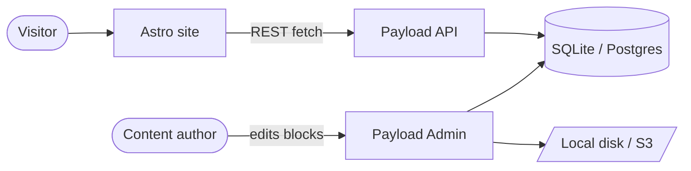

# SiteForge

A **self-hosted, WordPress-like website builder**. Content authors stack
**blocks** in a [Payload v3](https://payloadcms.com) admin UI; the public site —
built from the [AstroWind](https://github.com/onwidget/astrowind) template —
renders those blocks with AstroWind's widgets. Themes are swappable because the
only coupling point is a single block renderer.

- **Self-hosted, no external SaaS.** Auth, database and media all live in the
  project. Runs on a single VPS or any Node host.
- **Portable by default.** SQLite + local-disk media, so a site's entire state
  is _one file + one folder_ (your backup unit). Postgres + S3 are swap-ins
  behind one env var each.
- **Decoupled.** Payload owns the content model; Astro owns presentation. The
  block renderer maps one to the other.

---

## Architecture

```
apps/
  cms/        Payload v3 inside Next.js (admin UI + REST/GraphQL API + DB + media)
  web/        AstroWind-derived public site (consumes the CMS API)
packages/
  shared/     Generated Payload types, re-exported for the web app
deploy/       pm2, Nginx and Docker reference configs
```



**Render modes** (set by `RENDER_MODE`):

- `static` — Astro fetches all published content at **build time** and emits a
  static site. Fast, cacheable, no Node process for the site.
- `ssr` — Astro runs as a **Node server** (`@astrojs/node`) and fetches per
  request, enabling draft preview.

---

## Prerequisites

- **Node.js ≥ 20.9** (tested on 22)
- **pnpm 9** — `npm i -g pnpm@9`

---

## Quick start

```bash
# 1. Install
pnpm install

# 2. Configure — copy the example and edit the secret
cp .env.example .env

# 3. Seed the demo (creates admin user + Waterford Festival of Food site)
pnpm seed

# 4a. Run both apps in dev (CMS on :3000, web on :4321)
pnpm dev
```

- **Admin UI:** http://localhost:3000/admin
- **Demo login:** `admin@siteforge.dev` / `changeme123` _(change this!)_
- **Website:** http://localhost:4321

> The website fetches from the CMS. For a **static build**, the CMS must be
> running so the build can read content (`pnpm --filter cms dev`, then
> `pnpm --filter web build`). If the CMS is unreachable the site still builds,
> falling back to AstroWind's bundled navigation/defaults.

### Useful scripts

| Command                  | What it does                                       |
| ------------------------ | -------------------------------------------------- |
| `pnpm dev`               | Run CMS + web in watch mode (Turborepo)            |
| `pnpm build`             | Build both apps                                    |
| `pnpm seed`              | Idempotently populate the demo site                |
| `pnpm generate:types`    | Regenerate Payload types into `packages/shared`    |
| `pnpm --filter cms dev`  | Run only the CMS                                    |
| `pnpm --filter web build`| Build only the website                             |

---

## Environment & swappable adapters

A single root `.env` drives **both** apps. See [.env.example](.env.example).

| Variable                    | Purpose                                              |
| --------------------------- | ---------------------------------------------------- |
| `PAYLOAD_SECRET`            | Signs Payload auth tokens — **change in production** |
| `PAYLOAD_PUBLIC_SERVER_URL` | CMS URL the website fetches from                     |
| `WEB_PUBLIC_URL`            | Public URL of the website                            |
| `DB_ADAPTER`                | `sqlite` (default) or `postgres`                     |
| `DATABASE_URI`              | SQLite file URL (e.g. `file:./siteforge.db`)         |
| `POSTGRES_URL`              | Connection string when `DB_ADAPTER=postgres`         |
| `MEDIA_ADAPTER`             | `local` (default) or `s3`                            |
| `MEDIA_DIR`                 | Local upload directory (relative to `apps/cms`)      |
| `RENDER_MODE`               | `static` (default) or `ssr`                          |

**Switching is env-only — no code changes:**

- **Database:** set `DB_ADAPTER=postgres` and `POSTGRES_URL=...`. The adapter is
  selected in [apps/cms/src/config/db.ts](apps/cms/src/config/db.ts).
- **Media:** set `MEDIA_ADAPTER=s3` and the `S3_*` vars. Local disk is the
  default; the S3 plugin takes over when selected.
- **Render mode:** set `RENDER_MODE=ssr` to serve the site from a Node server
  instead of static files.

---

## Content model

**Collections:** `pages`, `posts`, `categories`, `media`, `users` (drafts &
versions enabled on pages and posts). **Globals:** `navigation`,
`siteSettings`.

Pages are built from a `layout` array of **12 blocks**, each mapping to an
AstroWind widget (see
[apps/web/WIDGET_PROPS.md](apps/web/WIDGET_PROPS.md) for the verified props and
[apps/web/src/lib/blocks.ts](apps/web/src/lib/blocks.ts) for the renderer):

| Block             | AstroWind widget(s)                         |
| ----------------- | ------------------------------------------- |
| `hero`            | Hero / Hero2 (`split`)                       |
| `features`        | Features / Features2 (`twocol`) / Features3 (`image`) |
| `content`         | Content                                      |
| `steps`           | Steps / Steps2 (`twocol`)                    |
| `stats`           | Stats                                        |
| `faqs`            | FAQs                                         |
| `pricing`         | Pricing                                      |
| `testimonials`    | Testimonials                                 |
| `brands`          | Brands                                       |
| `callToAction`    | CallToAction                                 |
| `blogLatestPosts` | BlogLatestPosts                              |
| `note`            | Note                                         |

**Swapping themes** = rewrite the renderer + widget components; the content
model is untouched.

The **blog** is fully driven by Payload posts — list pagination, category and
tag archives, related posts and RSS all read from the CMS
([apps/web/src/utils/blog.ts](apps/web/src/utils/blog.ts)).

---

## Seed (demo: a food festival)

`pnpm seed` idempotently builds the **Waterford Festival of Food** demo — five
block-built pages (Home, About, Programme, Plan Your Visit, Volunteer), a
populated nav/footer, branded site settings, sponsor logos and three blog
posts. It is safe to re-run (it upserts by slug).

- Drop real images in
  [apps/cms/src/seed/assets/](apps/cms/src/seed/assets/README.md) to replace the
  auto-generated colour placeholders.
- **Reset the demo:** delete the SQLite file and media folder, then re-run:
  ```bash
  rm apps/cms/siteforge.db apps/cms/media/* ; pnpm seed
  ```

---

## Deployment

### VPS — pm2 + Nginx

1. `pnpm install && pnpm --filter cms build`
2. For `static`: `pnpm --filter web build` (with the CMS running) and serve
   `apps/web/dist` as files. For `ssr`: `pnpm --filter web build` produces a
   Node server.
3. Start processes with pm2:
   ```bash
   pm2 start deploy/ecosystem.config.cjs
   ```
4. Put [deploy/nginx.conf](deploy/nginx.conf) in front as a reverse proxy
   (TLS + routing `/admin`, `/api`, `/graphql` → CMS; site → static files or
   the SSR server).

### Docker Compose

```bash
docker compose up --build
```

- `cms` (port 3000) — Payload admin + API, with a named volume `cms-data`
  holding the **SQLite file + media** (the backup unit).
- `web` (port 4321) — the website, built with `RENDER_MODE` (default `static`).
- Uncomment the `db` service in
  [docker-compose.yml](docker-compose.yml) to use Postgres instead.

Dockerfiles: [deploy/Dockerfile.cms](deploy/Dockerfile.cms),
[deploy/Dockerfile.web](deploy/Dockerfile.web).

---

## Backup & restore

With the default SQLite + local-disk media, **the entire site state is two
things**:

- the SQLite database file (`apps/cms/siteforge.db`, or the `cms-data` volume in
  Docker), and
- the media folder (`apps/cms/media`).

Back those up together; restoring them reproduces the site exactly.

---

## Tech stack

- **Monorepo:** pnpm workspaces + Turborepo
- **CMS:** Payload v3 on Next.js 15 (App Router), Node 20+
- **DB:** `@payloadcms/db-sqlite` (default) / `@payloadcms/db-postgres`
- **Media:** Payload local-disk upload (default) / S3 plugin
- **Site:** AstroWind (Astro 6 + Tailwind CSS 4)
- **Deploy:** pm2 + Nginx, or Docker Compose with named volumes
